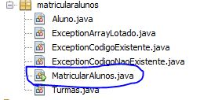
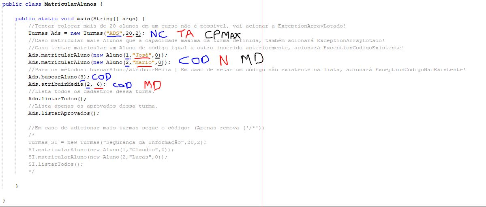

# Projeto MatricularAlunos
Projeto de um sistema cadastro básico desenvolvido durante as aulas de Programação Orientada a Objeto utilizando Java.

## Como utilizar
- A aplicação é bem básica, funcionando por meio do console do NetBeans. Com o projeto salvo em sua máquina e aberto no NetBeans, procure o arquivo **MatricularAlunos.java**:

    

- Agora dentro do **MatricularAlunos.java** você encontrará comentários ensinado a como utilizar todos os métodos criados e como acionar os tratamentos de erros.: 

    

- Descrição imagem: 
    - **NC:** Nome Curso;
    - **TA:** Total de Aulas;
    - **CPMAX:** Capacidade Máxima de Alunos na turma;
    - **COD:** Código do Aluno;
    - **N:** Nome do Aluno;
    - **MD:** Média do Aluno;

## Funcionalidades
* [x] Cadastro de alunos utilizando Array de Objetos; 

* [x] Gerenciamento dos dados dos alunos cadastrados; 

* [x] Todos os métodos funcionais;
